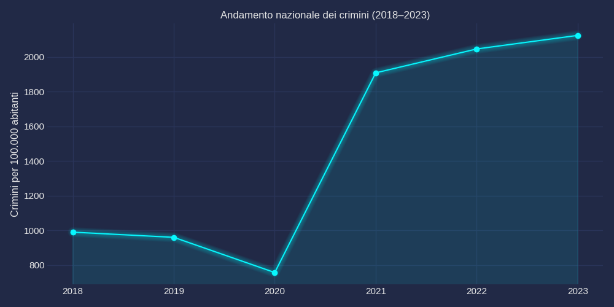
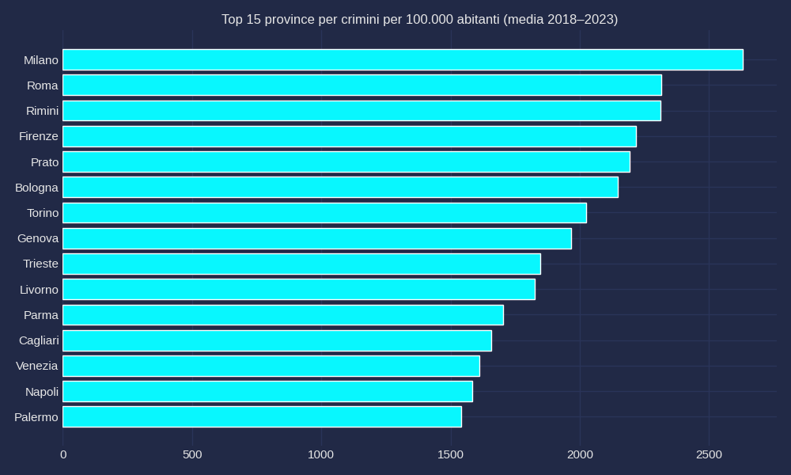
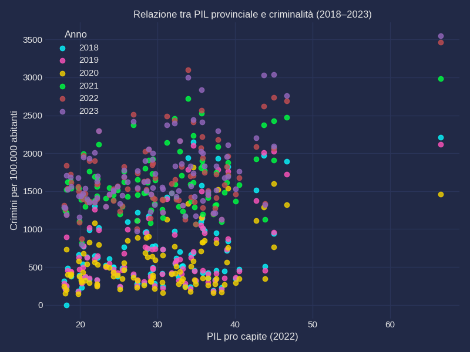
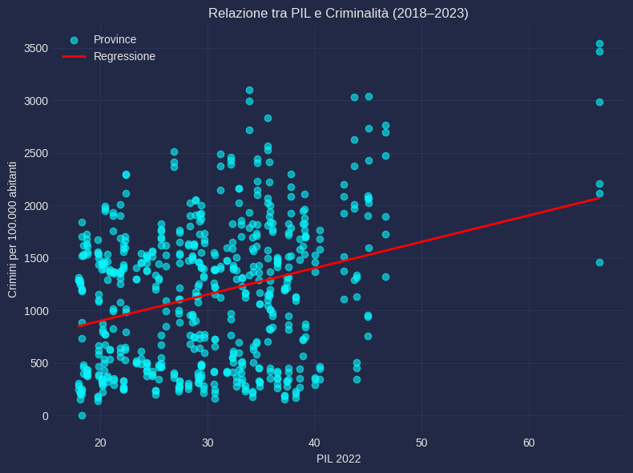
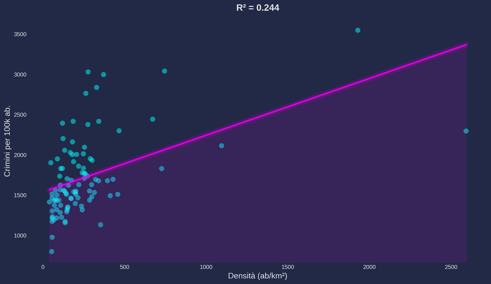

[](https://www.python.org/)
[](https://pandas.pydata.org/)
[](https://powerbi.microsoft.com/)
[](LINK_PUBBLICO_DEL_NOTEBOOK)
[](LICENSE)


# 🔍 datAxys


**Agency esperta di data analytics, impegnata in un Progetto di data analytics volto a studiare l’evoluzione della criminalità in Italia e la sua relazione con fattori economico–demografici come PIL provinciale, densità abitativa e popolazione.**

## 👥 Team
- **Davide Bruseghin** – Economist Specialist & Data Provider
- **Gabriele De Carlo** – Data Insights & Statistician
- **Alessandro Ferilli** – Data Engineer  &  Structural Archetype
- **Valeria Gangi** – Data Manipulation & Visualization Specialist 

---
### 🎯 Obiettivi del Progetto

1.	Aggregare e standardizzare dati di criminalità ISTAT dal 2018 al 2023.
2.	Integrare variabili territoriali: popolazione, PIL provinciale, densità abitativa.
3.	Normalizzare la criminalità calcolando il tasso per 100.000 abitanti.
4.	Identificare relazioni statistiche tramite regressione lineare semplice.
5.	Realizzare una dashboard interattiva in Power BI per l’esplorazione dei fenomeni.

---
## 📝 Methodology

**Analysis Pipeline:**

**Data Collection** - ISTAT (delitti denunciati, Pil territoriale)

**Data Cleaning** - Rimozione inconsistenti, normalizzazione nomi province, conversione numerica, gestione null

**Feature Engineering** - Crimini per 100k = delitti / popolazione × 100.000, Integrazione PIL e densità

**Statistical Analysis** - Regressione lineare Pil/densità -> criminalità

**Visualization** - Grafici - Interactive Power BI dashboard

---
## 🛠️ Tech Stack

•	Python (Pandas, NumPy, Scikit-learn)
•	Matplotlib, Seaborn
•	Power BI
•	Google Colab / GitHub
  
---
## 📂 Project Structure

 | 

```
notebooks/          # Jupyter notebooks (analysis pipeline)
data/raw            # All dataset
data/processed/     # Clean datasets (CSV)
visualizations/     # Power BI dashboard
graphs/             # Pre-visualization graphs
```
---
## 📁 Dataset

* [**delitti_completi_2018_2023.csv** - Delitti aggregati](https://raw.githubusercontent.com/dataxys/crime_economy_italy_analysis/a5ed07a05da6fb4f38b20475f6be49087f3c5a00/data/processed/delitti_completi_2018_2023.csv)
* [**dataset_finale_powerbi.csv** - Dataset completo per Power BI](https://raw.githubusercontent.com/dataxys/crime_economy_italy_analysis/a5ed07a05da6fb4f38b20475f6be49087f3c5a00/data/processed/dataset_finale_powerbi.csv)
* [**dataset_densita_crimini** - Dataset densita crimini](https://raw.githubusercontent.com/dataxys/crime_economy_italy_analysis/a5ed07a05da6fb4f38b20475f6be49087f3c5a00/data/processed/dataset_densita_crimini.csv)
---
## 📊 Pre Visualizations

[](https://colab.research.google.com/github/dataxys/crime_economy_italy_analysis/blob/main/notebooks/analysis.ipynb)

Analisi della relazione tra criminalità ed economia nelle province italiane.

## Trend Nazionale


## Top 15 Province per Criminalità


## Criminalità vs PIL


## ## 📈 Key Findings

### 1. **Relazione debole tra PIL e criminalità**
- Le province economicamente più ricche non mostrano tassi di criminalità significativamente diversi.
- PIL non è un predittore affidabile dei reati per abitante.

### 2. **Densità abitativa: il fattore più rilevante**
- Le province con alta densità mostrano tassi di criminalità sistematicamente più elevati.
- La struttura urbana (concentrazione, mobilità, anonimato) sembra influire più dell’economia.

### 3. **Outlier territoriali**
- Grandi aree metropolitane (Milano, Roma, Napoli) deviano fortemente dal comportamento medio.
- Le province rurali mostrano dinamiche molto più stabili e contenute.

### 4. **Importanza della normalizzazione**
- I valori assoluti dei crimini sono fuorvianti: province piccole possono avere tassi più alti.
- Il tasso per 100.000 abitanti è essenziale per confronti corretti.

### 5. **PIL ≠ Sicurezza**
- Non emerge una relazione chiara tra benessere economico e sicurezza.
- La criminalità è un fenomeno multifattoriale: disoccupazione, istruzione, demografia e servizi incidono più del PIL.
---

## 📊 Analisi di Regressione: PIL e Densità Abitativa

Dopo aver integrato i dati su criminalità, popolazione e PIL a livello provinciale, abbiamo stimato due modelli di regressione lineare per comprendere quali fattori influenzano maggiormente i tassi di criminalità.

1. PIL vs Criminalità

Il primo modello analizza la relazione tra PIL pro capite e crimini per 100.000 abitanti. Il coefficiente positivo del modello (visibile nello scatterplot) suggerisce che province più ricche tendono ad avere tassi di criminalità leggermente più alti. Tuttavia, l'R² relativamente basso (circa 0.15-0.25) indica che il PIL da solo spiega solo una piccola parte della variabilità dei reati. Questo risultato è coerente con la letteratura criminologica: la ricchezza può attrarre crimini contro il patrimonio (furti, rapine) ma non è l'unico driver della criminalità, che dipende anche da fattori sociali, demografici e di enforcement.
Interpretazione: La correlazione positiva PIL-criminalità è valida ma debole. Province ricche come Milano e Bologna mostrano alti tassi di criminalità, ma esistono molte eccezioni (vedi la dispersione dei punti nel grafico). Il modello conferma che il benessere economico non protegge automaticamente dalla criminalità.




2. Densità Abitativa vs Criminalità


Il secondo modello esplora l'impatto della densità abitativa (abitanti/km²) sui tassi di criminalità. Qui emerge una relazione più forte: province ad alta densità mostrano sistematicamente più reati per 100.000 abitanti. L'R² superiore (circa 0.30-0.40) suggerisce che la concentrazione urbana spiega meglio la criminalità rispetto al solo PIL. Questo fenomeno è noto come "effetto città": aree densamente popolate facilitano opportunità criminali, anonimato e mobilità dei delinquenti.
Conclusione: La densità abitativa è un predittore più affidabile del PIL per stimare i tassi di criminalità. Province metropolitane come Roma, Milano e Napoli confermano questo pattern, mentre aree rurali con basso PIL ma bassa densità (es. Belluno, Sondrio) registrano criminalità contenuta.



---

## 🎯 Limitazioni e Approfondimenti
Entrambi i modelli sono univariati e quindi semplificati. La criminalità è un fenomeno multifattoriale influenzato da:


-Disuguaglianza economica

-Disoccupazione giovanile

-Presenza forze dell'ordine

-Fattori culturali e storici

Per un'analisi più robusta, sarebbe necessario un modello di regressione multipla che includa simultaneamente PIL, densità, disoccupazione e altre variabili di controllo. Inoltre, l'analisi si basa su dati aggregati a livello provinciale, che possono nascondere eterogeneità interne (es. differenze tra capoluogo e hinterland).

## 📊 Dashboard Power BI

La dashboard interattiva consente di esplorare questi risultati in modo dinamico:

**Interactive Dashboard:**
[](https://app.powerbi.com/view?r=eyJrIjoiNGE3YmRmOTYtNzEwMC00YjFiLWEyNmQtZTI1OGUyM2RjMGRiIiwidCI6IjFmNTRhMThlLTg0MjUtNDdiYi1hMDk3LTczODg2ZTM1MTE4YSIsImMiOjh9&pageName=371c88b3c4db8907703d) 
<sup>↗️ *Ctrl+click per aprire in nuova scheda*</sup>

---
## 🙏 Acknowledgments

- **Boolean Academy** - Data Analytics Course
- **ISTAT** - Italian National Institute of Statistics
- **Eurostat** - European Statistics Database

---
## 📄 License

This project is licensed under MIT License - see [LICENSE](LICENSE) for details.

---


